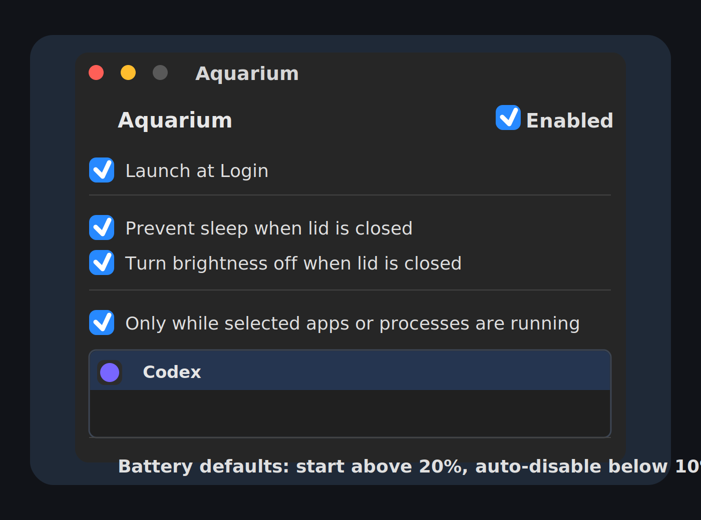

# Aquarium

Aquarium is a small macOS menu bar utility for keeping a Mac awake when the lid is closed. It can also turn the internal display brightness down while closed, limit the behavior to selected apps or processes, and stop itself around battery thresholds.

Build from source with `make build`, then run the debug app with `make open`. Install the privileged helper with `make install-helper`; macOS will ask for administrator approval because the helper writes the system `pmset disablesleep` setting.

For a release build, run `make package`. The packaged app is written to `.build/Aquarium-0.1.0.zip`.

Aquarium requires macOS 14 or newer. The default safety settings only start above 20% battery and auto-disable below 10%.

The current release is not notarized, so macOS Gatekeeper may block the first launch. Open System Settings after the warning and allow Aquarium from Privacy & Security, or right-click Aquarium and choose Open.
